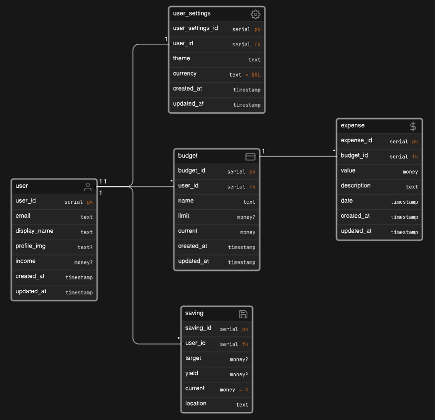

# Database

Not much is happening here. It's been a long time since I created and managed a database.
For now, this is a simple PostgreSQL database instance. I don't remember much about what the best practices are, but I'll try to, at least, be consistent.

## Model

This modeling can, and probably will, change along the way as I'm working with it.

:::note Notation

- When the type is proceeded by a question mark (`<data_type>?`) it means it is an optional column
- When a type is proceeded by an equal sign (`<data_type> = <value>`) it mean it has a default value set to `<value>`

:::

Some tables and columns will not be used in the first version of the app. But I think the best way to model a database is to think ahead. So, for example, I already defined a table to store user settings, e.g. preferred theme/currency, and a `saving` table where the user can store and manage their emergency fund or savings to buy a car.

:::note Table naming

The naming convention is to use snake case and singular for table names. It seems that `user_settings` is not following this, but it is. This table is a **set** of settings, not a table of settings (where each row would be one specific setting). I could define it as `user_settings_set` but I don't think it's necessary. And it doesn't sound good either.

:::